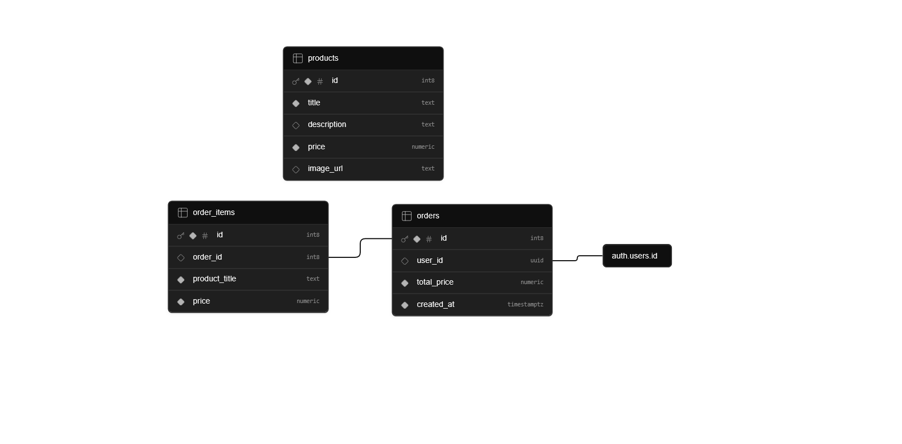

# Nom de ton application

Application de e-commerce développée avec **Flutter** et **Supabase**. Ce projet propose une expérience d'achat fluide, sécurisée et épurée.

## 🚀 Fonctionnalités principales

- **Authentification sécurisée** : Inscription et connexion via Supabase Auth.
- **Catalogue dynamique** : Récupération des produits en temps réel depuis une base de données PostgreSQL.
- **Gestion du panier** : Ajout d'articles, persistance locale et calcul des totaux.
- **Historique des commandes** : Suivi des achats passés avec vue détaillée par commande.
- **UX Épurée** : Interface sobre et navigation optimisée.

## 🏗️ Architecture Technique

- **Frontend** : Flutter (Dart)
- **Backend** : Supabase (PostgreSQL)
- **Architecture** : Séparation logique entre Services (API/Données), Modèles (Entités) et Écrans (UI).

## 🗄️ Modèle Conceptuel de Données (MCD)

La base de données repose sur une structure relationnelle permettant de lier les commandes aux utilisateurs et de détailler le contenu de chaque panier validé.

### Structure des tables :

1. **Users** : Gérés par Supabase Auth.
2. **Products** : Catalogue des articles.
3. **Orders** : Stocke l'en-tête de la commande (`user_id`, `total_price`, `created_at`).
4. **Order_items** : Stocke le détail des produits de chaque commande (`order_id`, `product_title`, `price`).

## 🛠️ Installation

1. Cloner le dépôt.
2. Configurer les clés Supabase dans `main.dart`.
3. Lancer `flutter pub get`.
4. Lancer l'application avec `flutter run`.

## 📸 Aperçu

